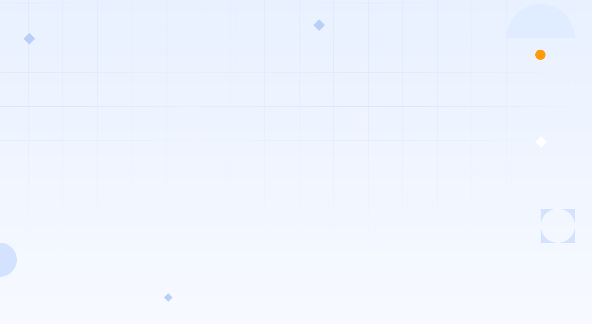

# Stashed

Image and Everything

```
<div class="pos-rel">
            
            
            <div class="pos-abs t-51-l-115 font-dmserif ft-sz-48 ft-wgt-400">
                <span class=" color-tertiary">Improve your </span>
                <span class="color-secondary">business <br>performance</span>
                <span class="color-tertiary">by empowering <br>your people.</span>
            </div>
            <div class="pos-abs t-241-l-119 font-manrope ft-sz-18 color-tertiary ft-wgt-400">
                <span>Get curated courses and dedicated consultation for your<br> employees at one place.</span>
            </div>
            <div class="pos-abs t-339 l-115">
                <button class="bg-secondary color-white font-manrope ft-sz-18 no-border br-5 padd-18-53 ft-wgt-500">View
                    courses</button>
                <button class="ft-sz-18 no-border">&emsp;</button>
                <button class="border-tertiary no-bg br-5 ft-sz-18 padd-17-52 color-tertiary ft-wgt-500">How it works
                    ?</button>
            </div>
            <div class=" pos-abs t-519-l-115">
                <!-- Design -->
                <div class="pos-abs t-0-l-0" style="height: 147px; width: 510px; display: grid; place-items: center;">
                    <div class="pos-abs t-30-l-30 flex-center" style="justify-content: end;">
                        <span class="font-manrope">Are you ready for VUCA Environment?</span><button
                            class="bg-quaternary br-16 no-border padd-6-21 color-tertiary pos-abs"
                            style="left: 361px;">View
                            Article</button>
                    </div>
                    <div class="pos-abs t-74-l-30 flex-center">
                        <span class="font-manrope">Why IT Capability Assessment?</span>
                        <button class="bg-quaternary br-16 no-border padd-6-21 color-tertiary">View Article</button>
                    </div>
                </div>
            </div>
        </div>
```